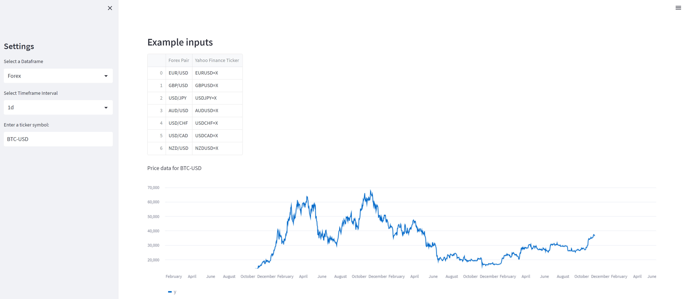
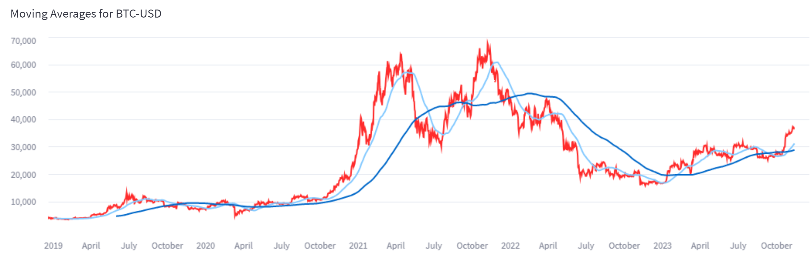
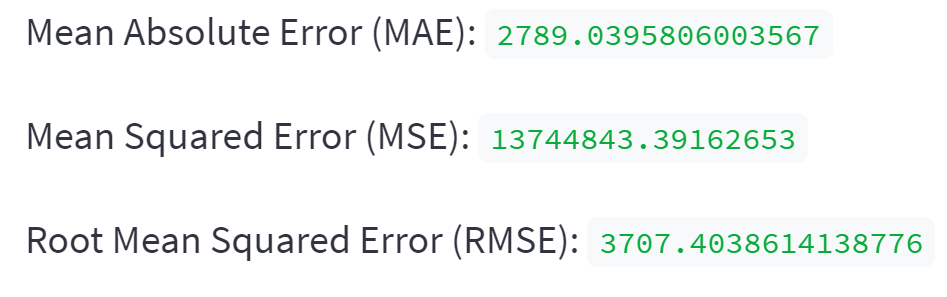
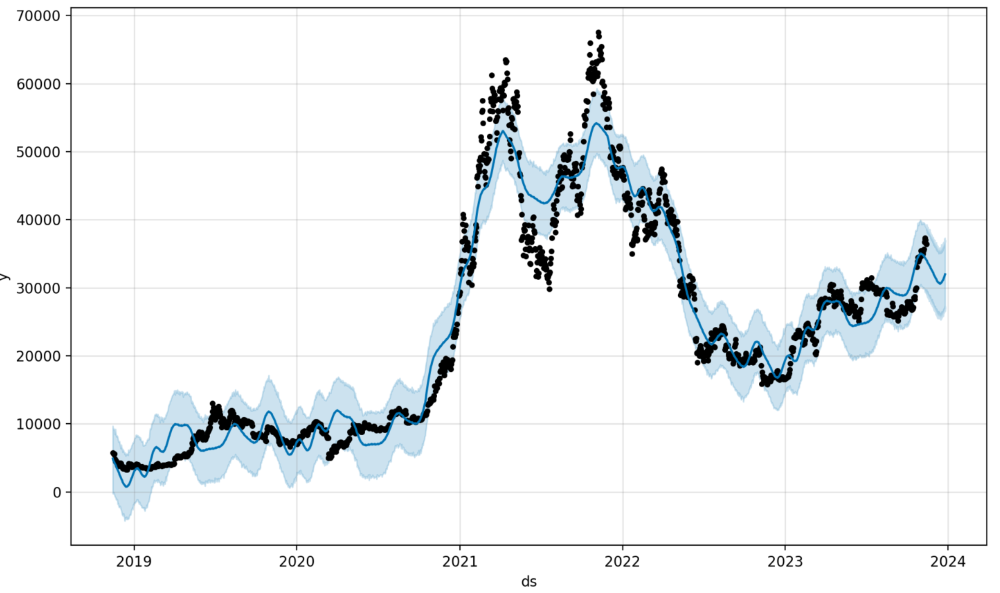
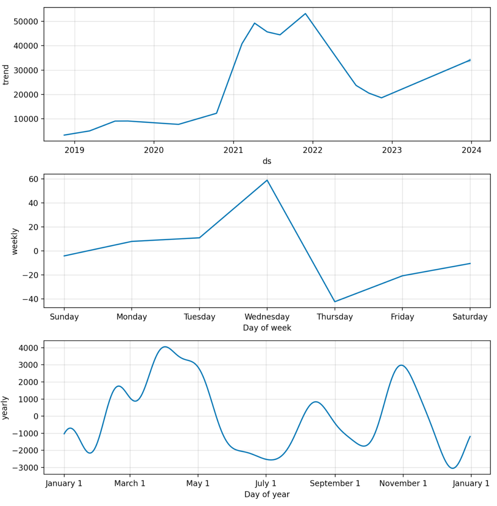
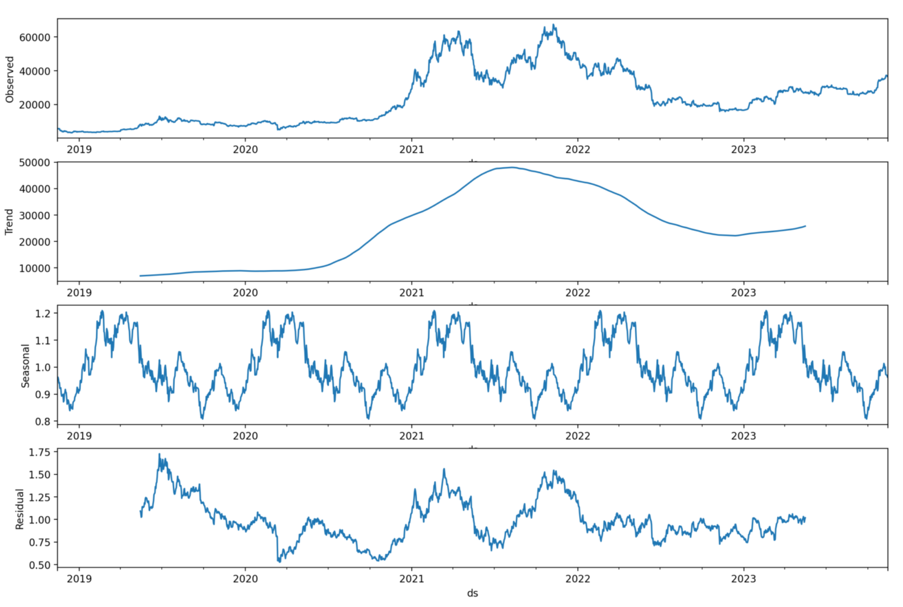
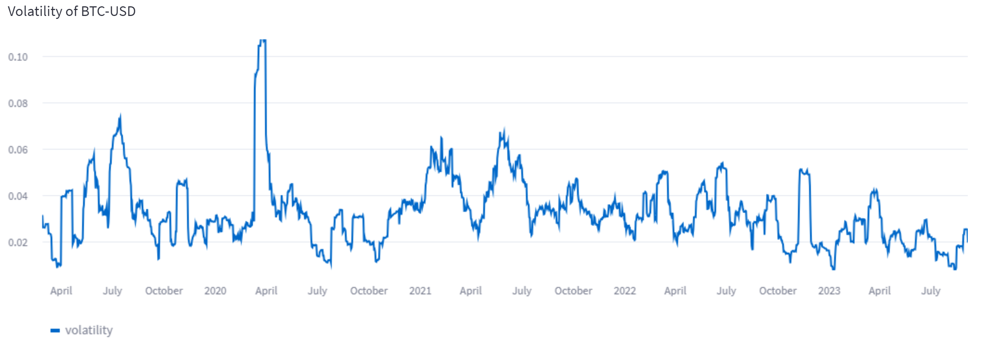

# Asset Price Prediction App

---

Deployed app: https://assetforecaster.streamlit.app/

---

This Streamlit app is designed to fetch, analyze, and visualize asset price data using the Yahoo Finance API and the Prophet time series forecasting model. Users can select a financial instrument, such as Forex pairs, cryptocurrencies, commodities, or indices, and input a ticker symbol to analyze historical price data and make future price predictions.

## Table of Contents

- [Prerequisites](#prerequisites)
- [Installation](#installation)
- [Usage](#usage)
- [App Overview](#app-overview)
- [Contributing](#contributing)

## Prerequisites

Before running the app, make sure you have the following libraries and dependencies installed:

- pandas
- hvplot
- datetime
- holoviews
- prophet
- yfinance
- streamlit
- scikit-learn
- statsmodels
- matplotlib

You can install them using `pip` or `conda`. For example:

        pip install pandas hvplot holoviews prophet yfinance streamlit scikit-learn statsmodels matplotlib

## Installation

Clone this repository:

        git clone https://github.com/RichieGarafola/AssetPricePrediction
        cd AssetPricePrediction

Run the Streamlit app:

        streamlit run forecaster.py
        

## Usage
- Upon running the app, you will be presented with a sidebar and main content area.

- In the sidebar, you can select a financial instrument category (Forex, Cryptocurrency, Commodities, Indices) using the "Select a Dataframe" dropdown.

- Choose a timeframe interval (e.g., 1d, 1wk, 1mo) for data analysis using the "Select Timeframe Interval" dropdown.

- Enter the ticker symbol (e.g., BTC-USD) of the asset you want to analyze in the "Enter a ticker symbol:" input field.

- The app will fetch historical price data from Yahoo Finance, perform time series forecasting using the Prophet model, and display various visualizations and analysis results.

## App Overview

The app provides the following features and visualizations:

- Historical price data and predicted price data line charts.
- Visualizations of forecast components (trend, seasonality, holidays) using Prophet.
- Performance metrics (Mean Absolute Error, Mean Squared Error, Root Mean Squared Error).
- Volatility analysis (rolling window volatility).
- Moving averages (simple moving averages of 50 and 200 periods).
- Seasonal decomposition plot (observed, trend, seasonal, residual).

## Contributing

Contributions to this project are welcome. You can contribute by:

- Reporting issues and bugs.
- Enhancing the app's functionality.
- Improving the app's user interface.
- Adding new features or visualizations.
- Feel free to fork the repository and submit pull requests.

## Glossary

